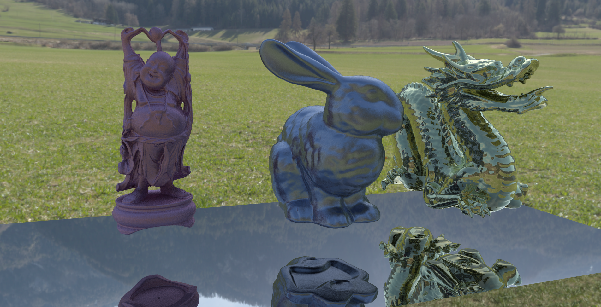
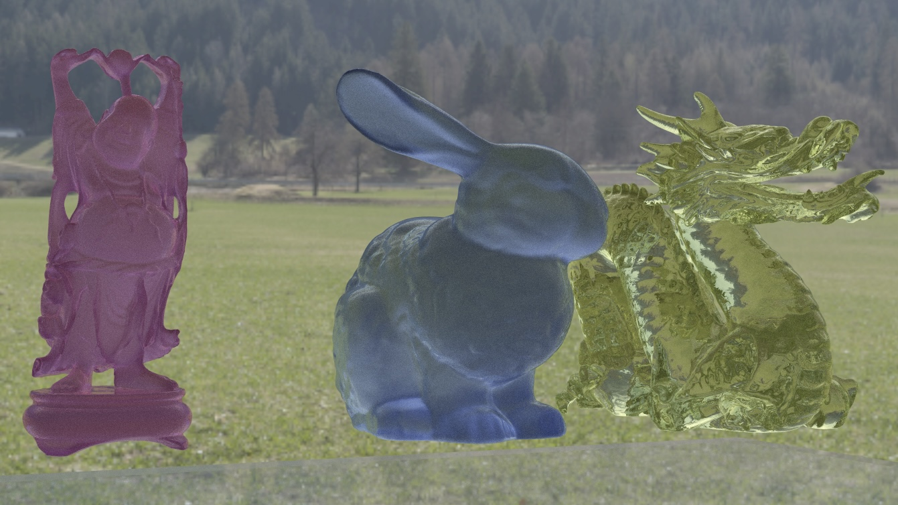
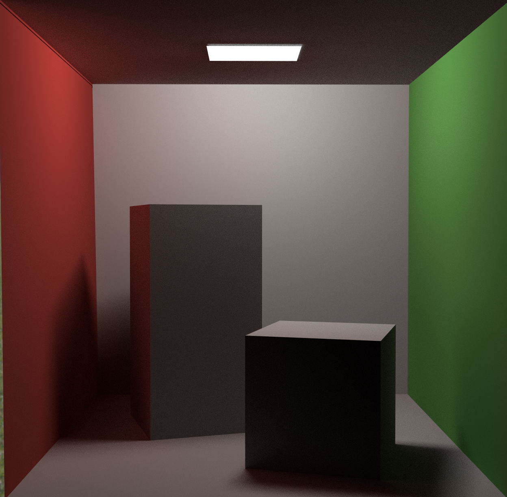
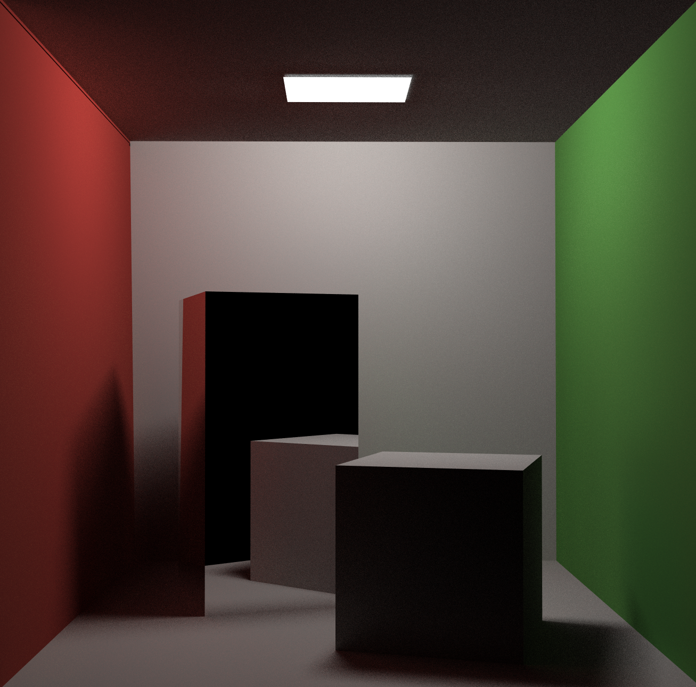
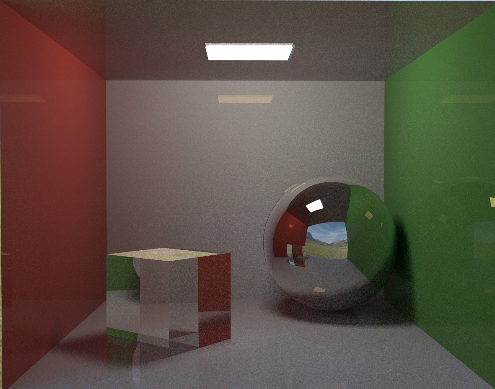
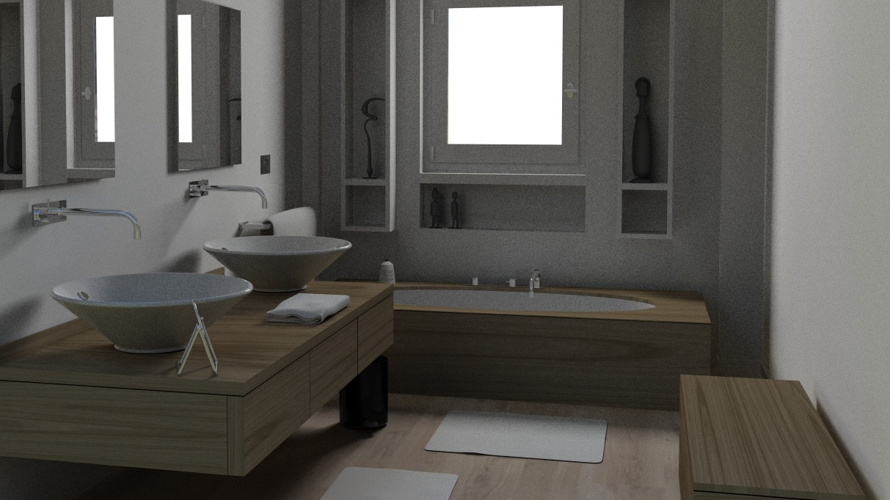

# 基于OptiX架构的光线追踪渲染器

## 项目环境
OptiX 7  
CUDA 12  
Visual Studio 2022

## 项目结构
LauchParams.h 缓冲区结构体  
Material_def.h 材质结构体  
MyInteraction.h 求交结构体  
Model.h 模型加载  
MyMaterial.h bsdf函数   
MyTools.h 工具函数  
PostProcess.h 屏幕空间后处理  
SampleRenderer.h 渲染器架构  
deviceProgram.cu 着色器代码  
MyShader.c char[]格式着色器机器码

## 实现功能
GPU加速  
蒙特卡洛路径追踪  
PBR材质  
直接光采样  
时域降噪  
环境光贴图   
纹理贴图  
法向插值  
屏幕空间后处理  

## 实现细节

### GPU加速
基本只是调用OptiX API，代码参考了
https://github/ingowald/optix7course/tree/master

### 蒙特卡洛路径追踪
使用最传统的蒙特卡洛算法  
spp = 1  
maxbounce = 24

### PBR材质
分为diffuse、specular、dielectric三种bsdf函数，通过材质的metallic和transmission参数（mtl格式中的Tf[0]，0表示完全不透射，1表示完全透射）计算选择每一种bsdf函数的概率，详见MyMaterial.h中的cal_bsdf函数

#### diffuse bsdf：  
采样：：均匀在半球采样  
bsdf计算公式：
$$
f_d = \frac{\text{baseColor}}{\pi} \left(1 + (F_{D90} - 1)(1 - \cos \theta_l)^5\right) \left(1 + (F_{D90} - 1)(1 - \cos \theta_v)^5\right)
$$
$$
F_{D90} = 0.5+2 \cdot roughness \cdot basecolor
$$

#### specular bsdf:  
采样：一种近似的bsdf采样，根据roughness对完美反射向量和随机在半球采样得到的向量进行插值  
bsdf计算公式：  
$$
D_{GGX}(m) = \frac{\alpha^2}{\pi((n \cdot m)^2 (\alpha^2 - 1) + 1)^2}
$$
$$
F_{schlick}(v,h)=F_0+(1-F_0)(1-(v \cdot h))^5
$$
$$
G = \frac{n \cdot l}{lerp(n \cdot l,1,k)} \times \frac{n \cdot v}{lerp(n \cdot v,1,k)}
\newline
k=\frac{(\alpha + 1)^2}{8}
$$
$$
f(l,v)=\frac{D(h)F(v,h)G(l,v,h)}{4(n \cdot l)(n \cdot v)}
$$

#### dielectric bsdf：  
采样：根据roughness对完美折射向量和随机在半球采样得到的向量进行插值  
全反射和菲涅尔现象：从介质射入空气时，考虑是否发生全反射，同时每次光线弹舌时，根据菲涅尔系数计算发射折射与反射的概率

### 直接光采样
为解决封闭场景中难以采样光源的问题，对diffuse材质额外采用直接光采样。
光线与模型相交后，如果是diffuse材质，则从面光源上随机选一点发射一条shadowray对光源进行采样

### 时域降噪
给每个像素一个buffer储存平均颜色信息，当视角改变后清空buffer重新计算

### 环境光贴图  
读取hdr格式环境光纹理，转换到rgb空间

### 屏幕空间后处理
对储存每个像素颜色信息的buffer进行操作，转换到hsv空间调整亮度、饱和度、对比度再转换回rgb空间

## 效果展示

## 项目分工
独自完成
